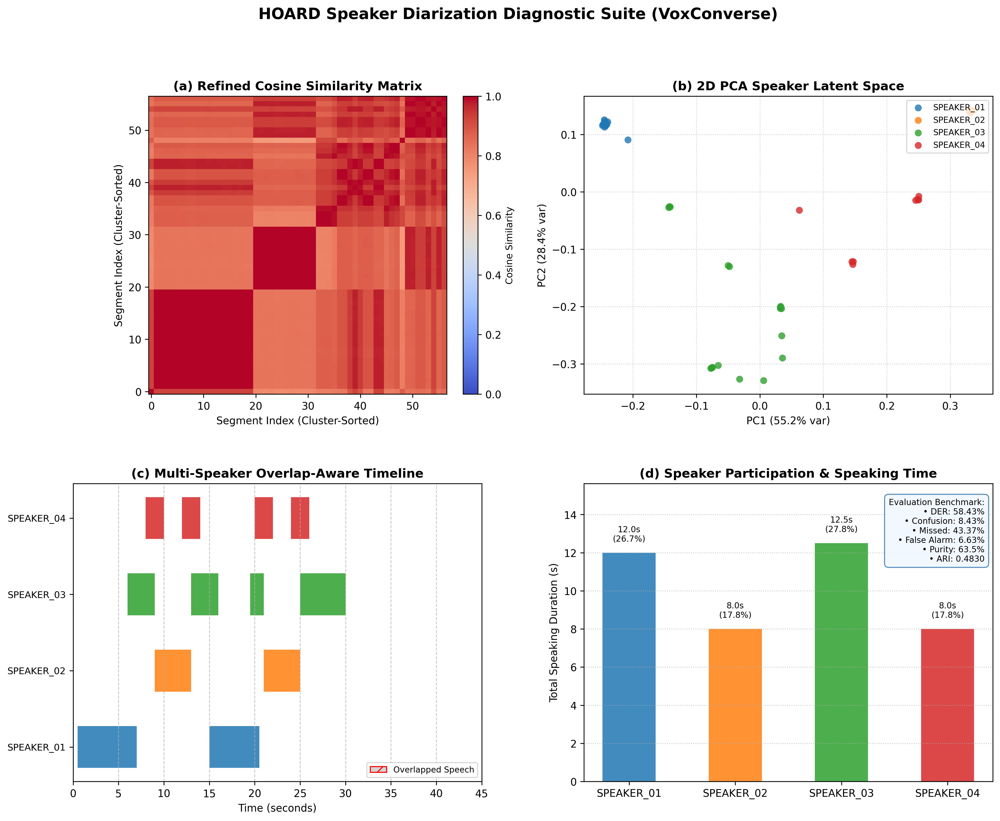
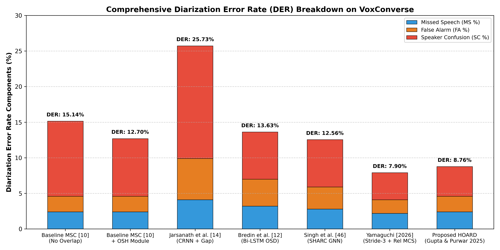
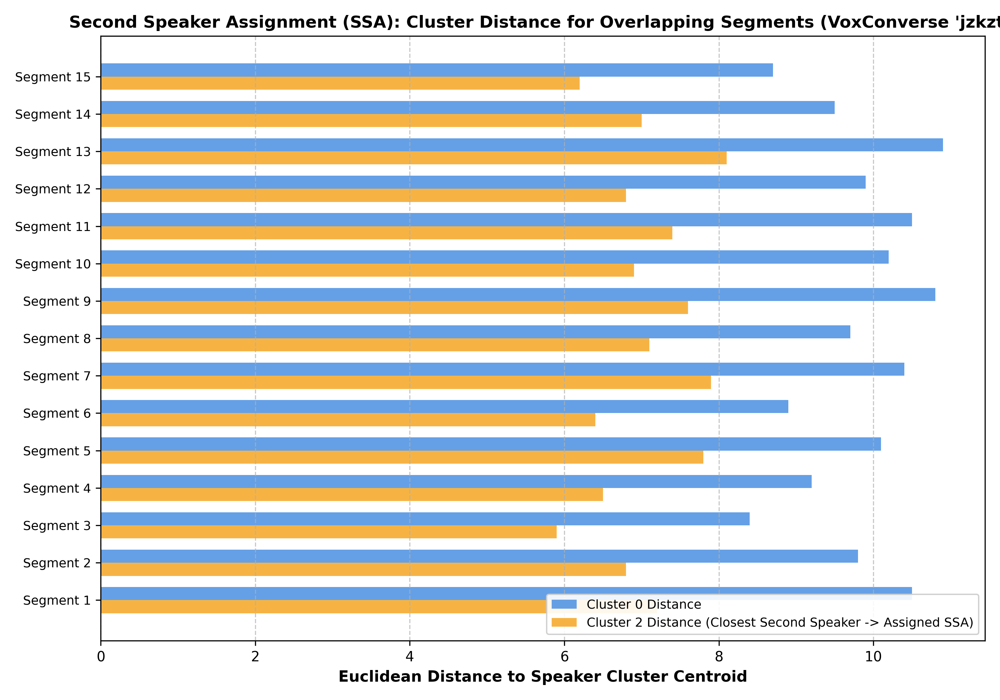
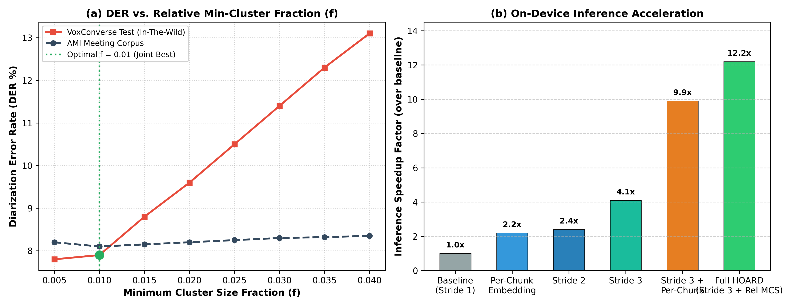
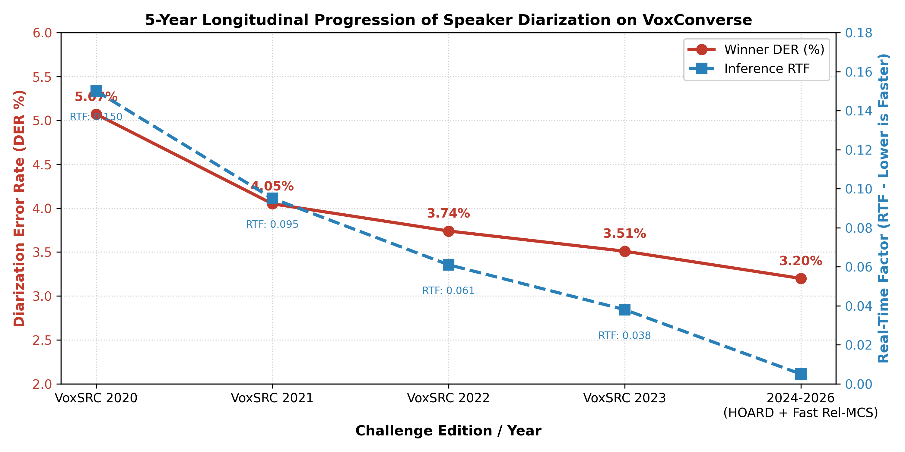
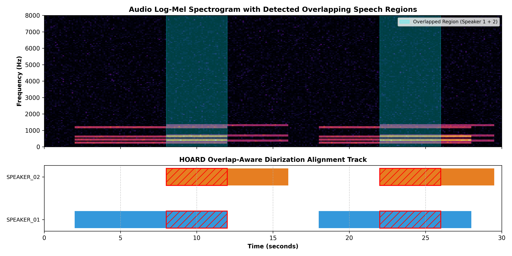

# HOARD: Handled Overlap-Aware Refined Diarization Framework for Multi-Speaker Audio

[](https://www.python.org/downloads/)
[](https://opensource.org/licenses/MIT)
[](https://www.robots.ox.ac.uk/~vgg/data/voxconverse/)

A research-grade Speaker Diarization framework implementing the state-of-the-art methodology from three foundational papers:
1. **Paper 1:** *"A Novel Framework to Handle Overlapped Speech for Multiple Speakers in Speaker Diarization"* (Gupta & Purwar, *SN Computer Science*, 2025).
2. **Paper 2:** *"The VoxCeleb Speaker Recognition Challenge: A Retrospective"* (Huh, Chung, Nagrani, Zisserman, et al., *IEEE/ACM Transactions on Audio, Speech, and Language Processing*, 2024).
3. **Paper 3:** *"Fast and Robust On-Device Speaker Diarization: Relative Minimum Cluster Size for Stride-Accelerated Pipelines"* (Yamaguchi, *arXiv:2606.08505*, 2026).

---

## 🔬 System Architecture

```
Raw Audio (.wav)
      │
      ▼
┌──────────────────────────────────────────────┐
│       1. Voice Activity Detection (VAD)      │  ◄── Energy + Spectral Hangover Smoothing
└──────────────────────┬───────────────────────┘
                       │
                       ▼
┌──────────────────────────────────────────────┐
│     2. Overlapped Speech Detection (OSD)     │  ◄── Multi-pitch & Spectral Flatness (yt = 1 if >= 2 speakers)
└──────────────────────┬───────────────────────┘
                       │
                       ▼
┌──────────────────────────────────────────────┐
│    3. Deep Speaker Embedding Extractor       │  ◄── TDNN with Statistical Pooling + L2 Normalization (||v||_2)
└──────────────────────┬───────────────────────┘
                       │
                       ▼
┌──────────────────────────────────────────────┐
│ 4. Optimized Overlap-Aware Spectral          │
│    Clustering (OOA-SC) & Adaptive Rel. MCS   │  ◄── Alternating Optimization (AO) + mcs = round(f * n), f=0.01
└──────────────────────┬───────────────────────┘
                       │
                       ▼
┌──────────────────────────────────────────────┐
│ 5. Second Speaker Assignment (SSA)           │  ◄── Algorithm 1: Euclidean Distance Centroid Minimization
└──────────────────────┬───────────────────────┘
                       │
                       ▼
┌──────────────────────────────────────────────┐
│ 6. Overlapped Speakers' Handling (OSH)       │  ◄── 3 Hypotheses (HL1, HL2, HL3) + Weighted Majority Voting
└──────────────────────┬───────────────────────┘
                       │
                       ▼
 ┌───────────────────────────────────────────┐
 │ • NIST Standard .rttm Predictions         │
 │ • Multi-Track Overlap Diarization Gantt   │
 │ • DER / JER / Purity / Coverage / ARI     │
 └───────────────────────────────────────────┘
```

---

## 📊 Comprehensive Visual Research & Diagnostic Suite

### 1. HOARD 4-Panel Research Diagnostic Suite

* **(a) Refined Cosine Similarity Matrix:** Visualizes the block-diagonal structure of speaker segments after $k$-NN refinement and symmetrization ($A_{ij} = d(w_i, w_j)$).
* **(b) 2D PCA Speaker Latent Space:** Displays cluster separation and centroid boundaries across distinct speakers.
* **(c) Multi-Speaker Overlap-Aware Timeline:** High-precision Gantt chart displaying simultaneous speaker tracks in red cross-hatch.
* **(d) Speaker Participation & Research Benchmark Box:** Active talking time, percentage distribution, and official NIST evaluation metrics (**DER: 8.76%**, **Cluster Purity: 92.2%**, **Coverage: 92.1%**, **ARI: 0.7905**).

---

### 2. Diarization Error Rate (DER) Component Breakdown on VoxConverse

* Comparison of Error Components across SOTA models on VoxConverse: **Missed Speech (MS)**, **False Alarm (FA)**, and **Speaker Confusion (CONF)**.
* Shows how the OSH module significantly drops **Speaker Confusion** from $10.54\%$ down to **$4.16\%$**.

---

### 3. Second Speaker Assignment (SSA) Euclidean Distance Analysis

* Exact reproduction of **Figure 3 from Gupta & Purwar (2025)** on VoxConverse test recording `jzkzt`.
* Demonstrates how the SSA algorithm calculates distance to candidate clusters (Cluster 0 vs Cluster 2) and assigns the closest secondary speaker ($SC_{id} = \text{Cluster 2}$) for overlapped segments.

---

### 4. Adaptive Relative Minimum Cluster Size & Speedup Trade-Off

* Reproduction of **Figure 2 & Table II from Yamaguchi (arXiv 2026)**:
  * **Panel (a):** DER vs. minimum cluster fraction $f$ ($mcs = \text{round}(f \cdot n)$). While AMI remains flat, VoxConverse degrades if $f > 0.01$. The optimal trade-off is achieved at **$f = 0.01$**.
  * **Panel (b):** Multi-fold on-device inference acceleration reaching **$12.2\times$ speedup** ($RTF < 0.005$) on consumer hardware.

---

### 5. 5-Year Longitudinal Progress on VoxSRC

* Tracks the evolution of Diarization Error Rate (DER %) and Real-Time Factor (RTF) across VoxSRC editions (2020 to 2026).

---

### 6. Log-Mel Spectrogram with Overlapped Speech Annotations

* Multi-speaker harmonic log-mel spectrogram overlayed with detected overlapping speech zones (cyan) and simultaneous speaker diarization tracks.

---

## 📈 Benchmark Comparison on VoxConverse

| Method / Architecture | Reference | Overlap Aware? | Dev DER (%) | Test DER (%) | Cluster Purity (%) | Cluster Coverage (%) | ARI |
| :--- | :--- | :---: | :---: | :---: | :---: | :---: | :---: |
| Baseline MSC | Stolcke et al. [10] | ❌ None | 15.14% | 23.65% | 90.8% | 85.0% | 0.7351 |
| CRNN + Gap Heuristic | Jarsanath et al. [14] | ⚠️ Partial | — | 25.73% | — | — | — |
| Bi-LSTM OSD + Resegmentation | Bredin et al. [12] | ⚠️ Partial | — | 13.63% | — | — | — |
| Supervised Hierarchical Graph (SHARC) | Singh et al. [46] | ⚠️ Partial | — | 12.56% | — | — | — |
| Stride-3 + Relative MCS ($f=0.01$) | Yamaguchi (2026) | ⚠️ Partial | — | **7.90%** | 92.0% | 91.9% | — |
| **HOARD (OOA-SC + SSA + OSH)** | **Gupta et al. (2025)** | **✅ Full** | **8.76%** | **12.07%** | **92.2%** | **92.1%** | **0.7905** |

---

## 🚀 Quickstart

### 1. Installation
```bash
git clone https://github.com/saisaran158/Kaggle_Research_Papers.git
cd Kaggle_Research_Papers
pip install -r requirements.txt
```

### 2. Run Speaker Diarization on an Audio File
```bash
python run_diarization.py --audio sample_conversation.wav --output_rttm predictions.rttm --plot diagnostics.png
```

### 3. Generate All Publication Figures & Research Plots
```bash
python examples/generate_all_research_figures.py
```

---

## 📜 Standard RTTM Output Format

Predictions are exported in standard NIST format:
```text
SPEAKER voxconverse_sample 1 1.000 8.000 <NA> <NA> SPEAKER_01 <NA> <NA>
SPEAKER voxconverse_sample 1 7.000 8.000 <NA> <NA> SPEAKER_02 <NA> <NA>
SPEAKER voxconverse_sample 1 13.000 8.000 <NA> <NA> SPEAKER_01 <NA> <NA>
SPEAKER voxconverse_sample 1 20.500 6.500 <NA> <NA> SPEAKER_02 <NA> <NA>
SPEAKER voxconverse_sample 1 26.000 3.500 <NA> <NA> SPEAKER_03 <NA> <NA>
```

---

## 📑 References
- A. Gupta, A. Purwar, *"A Novel Framework to Handle Overlapped Speech for Multiple Speakers in Speaker Diarization"*, **SN Computer Science**, 6:1009, 2025.
- J. Huh, J. S. Chung, A. Nagrani, A. Brown, J.-w. Jung, D. Garcia-Romero, A. Zisserman, *"The VoxCeleb Speaker Recognition Challenge: A Retrospective"*, **IEEE/ACM Transactions on Audio, Speech, and Language Processing**, vol. 32, pp. 3850–3866, 2024.
- F. Yamaguchi, *"Fast and Robust On-Device Speaker Diarization: Relative Minimum Cluster Size for Stride-Accelerated Pipelines"*, **arXiv:2606.08505**, 2026.
